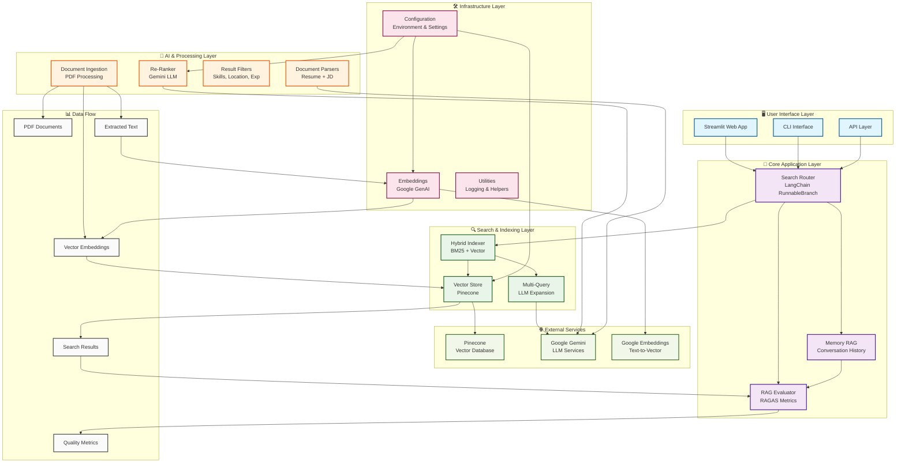
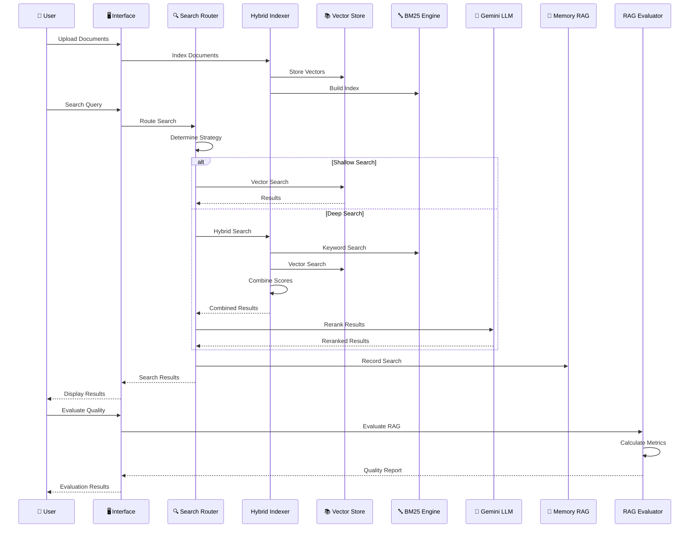
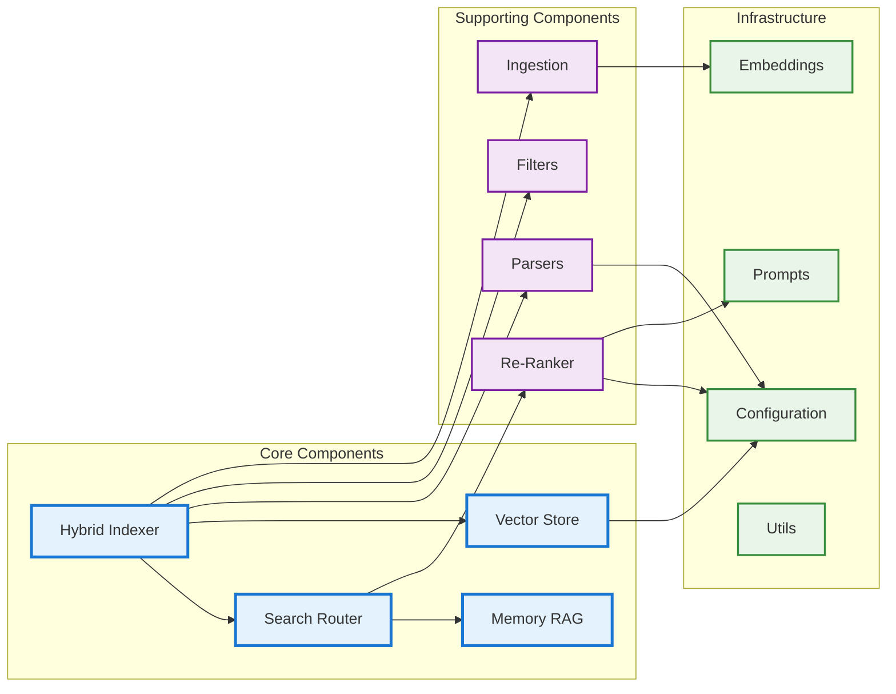

# 🎯 HireFlow System Architecture

## System Overview
HireFlow is an AI-powered recruitment platform that combines semantic search with Generative AI to intelligently match candidates to job descriptions.

## 🏗️ Complete System Architecture

## 🔄 Detailed Data Flow Diagram

## 🏛️ Component Relationship Diagram

## 📊 System Metrics & Monitoring

```mermaid
graph TB
    subgraph "System Health"
        HEALTH[System Status]
        PERFORMANCE[Performance Metrics]
        ERRORS[Error Tracking]
    end
    
    subgraph "Search Analytics"
        QUERIES[Search Queries]
        RESULTS[Result Quality]
        USAGE[Usage Patterns]
    end
    
    subgraph "AI Performance"
        LLM_METRICS[LLM Response Times]
        ACCURACY[Search Accuracy]
        RERANKING[Reranking Quality]
    end
    
    subgraph "Infrastructure"
        VECTOR_STATUS[Vector Store Status]
        API_STATUS[External API Status]
        MEMORY_USAGE[Memory Usage]
    end
    
    HEALTH --> PERFORMANCE
    HEALTH --> ERRORS
    QUERIES --> RESULTS
    RESULTS --> USAGE
    LLM_METRICS --> ACCURACY
    ACCURACY --> RERANKING
    VECTOR_STATUS --> API_STATUS
    API_STATUS --> MEMORY_USAGE
```

## 🎯 Key Features & Capabilities

- **🔍 Hybrid Search:** Combines BM25 keyword search with vector similarity

- **🤖 AI-Powered:** LLM-based reranking and evaluation with hardcoded prompts
- **📊 Quality Assessment:** RAGAS-based system evaluation
- **🧠 Memory System:** Persistent search history and analytics
- **🔄 Multi-Query:** Intelligent query expansion for better recall
- **📱 Dual Interface:** Web (Streamlit) + CLI interfaces
- **⚡ Scalable:** Modular architecture for easy extension
- **📚 Teaching-Friendly:** Clean, well-documented code structure

## 💡 **Simplified Design Philosophy**

This architecture follows the **KISS principle** (Keep It Simple, Stupid) by:

- **🎯 Direct Integration:** Components use hardcoded prompts for simplicity
- **🔧 Minimal Dependencies:** No complex prompt management overhead
- **📚 Learning Focus:** Easy to understand and modify for educational purposes
- **⚡ Performance:** Direct LLM calls without caching layers
- **🛠️ Maintainability:** Simple, straightforward code structure

This architecture provides a **robust, scalable, and maintainable** foundation for AI-powered recruitment, perfectly suited for both **production deployment** and **educational purposes**.
